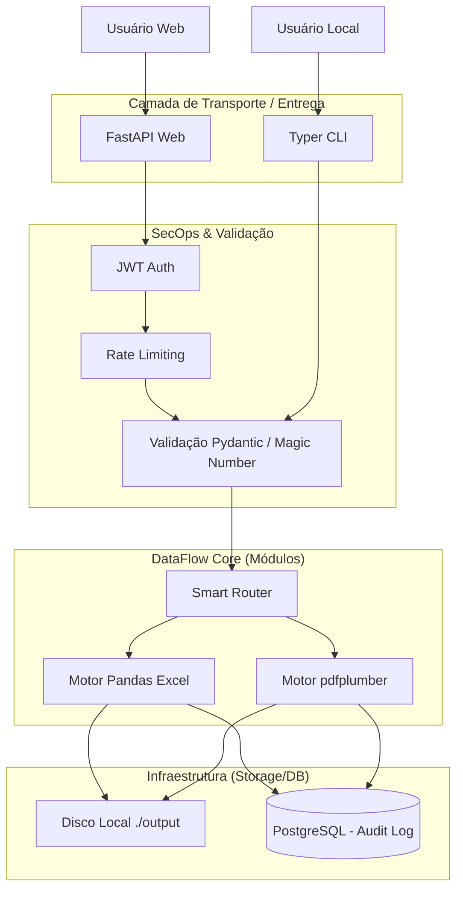

# Arquitetura e Diagramas do Sistema

## 1. Diagrama de Arquitetura (Hexagonal Flow)
Este diagrama mostra como o nosso Core (Motor) está isolado, podendo ser chamado tanto pelo Terminal (Fase 1) quanto pela Nuvem (Fase 2).



## 2. Diagrama de Entidade-Relacionamento (Banco de Dados)
Modelo básico de como as entidades se relacionam no nosso banco para auditoria.
```mermaid
erDiagram
    USERS ||--o{ JOBS : creates
    JOBS ||--|{ AUDIT_LOGS : generates
    
    USERS {
        uuid id PK
        string email
        string password_hash
        string role "admin, user"
        datetime created_at
    }
    
    JOBS {
        uuid id PK
        uuid user_id FK
        string original_filename
        string file_type "excel, pdf"
        string status "pending, processing, success, error"
        string output_path
        datetime started_at
        datetime finished_at
    }
    
    AUDIT_LOGS {
        uuid id PK
        uuid job_id FK
        string action "file_received, data_cleaned, rows_removed, saved"
        text error_traceback
        datetime timestamp
    }
