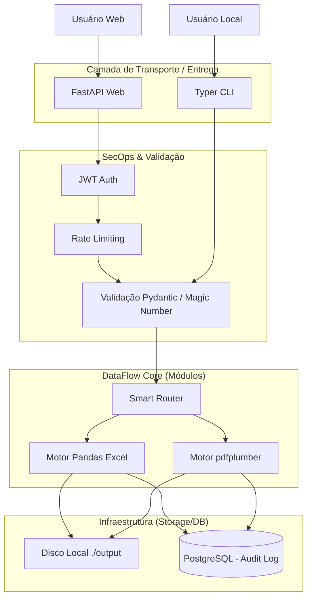
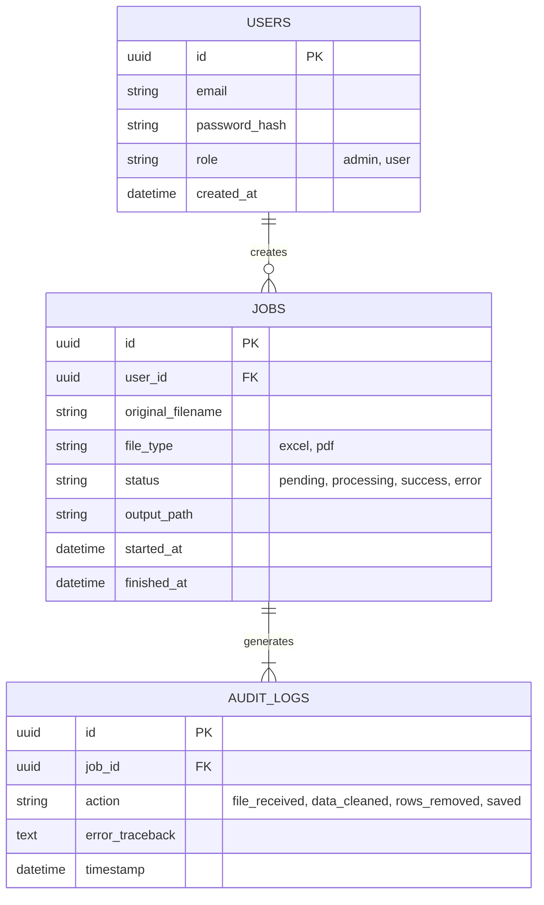
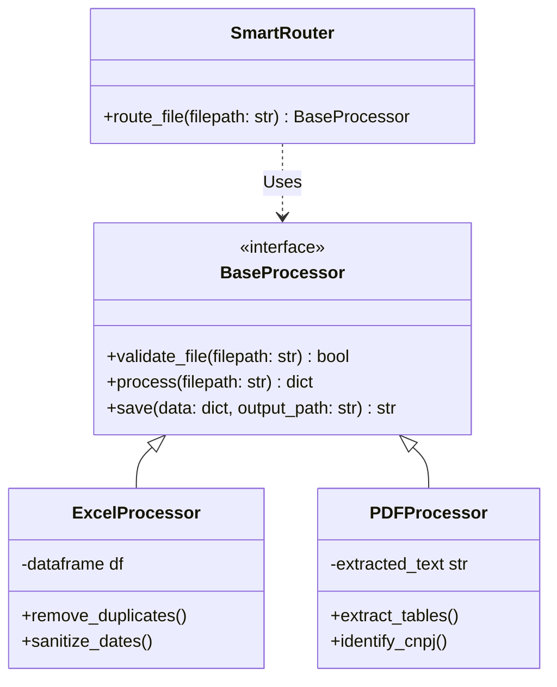
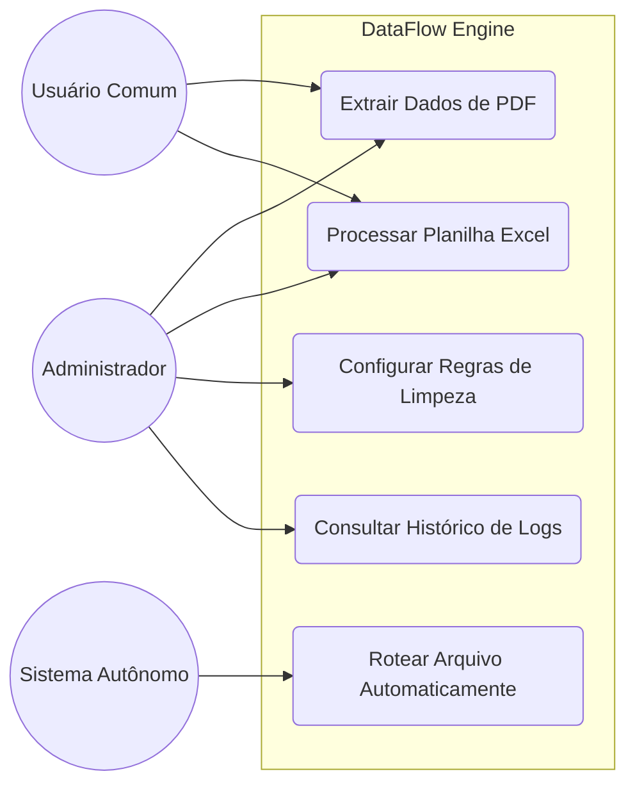
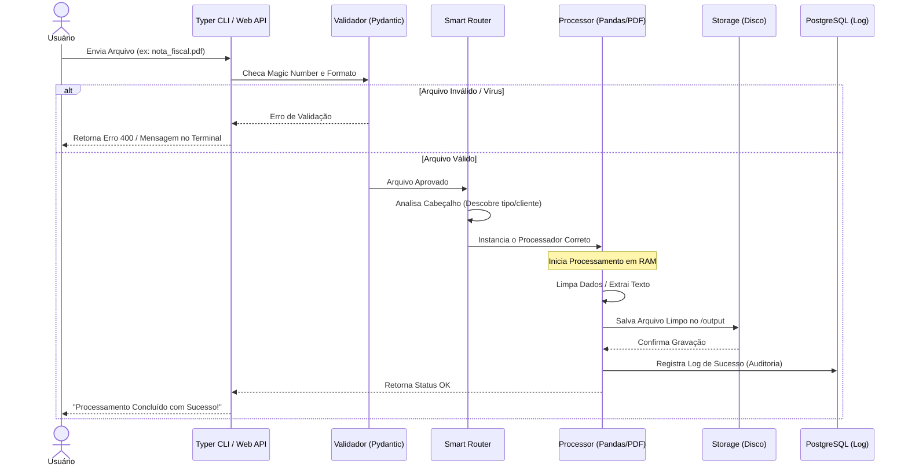

# Arquitetura e Diagramas do Sistema

## 1. Diagrama de Arquitetura (Hexagonal Flow)
Este diagrama mostra como o nosso Core (Motor) está isolado, podendo ser chamado tanto pelo Terminal (Fase 1) quanto pela Nuvem (Fase 2).

## 2. Diagrama de Entidade-Relacionamento (Banco de Dados)
Modelo básico de como as entidades se relacionam no nosso banco para auditoria.

## 3. Diagrama de Classes (Processadores)
Estrutura de herança dos processadores de arquivos do Core.

## 4. Diagrama de Casos de Uso
Mapeamento das ações que os diferentes perfis de usuários podem executar no DataFlow Engine.

## 5. 5. Diagrama de Sequência (Fluxo de Processamento de Arquivo)
A linha do tempo exata de como um arquivo entra sujo e sai limpo.

